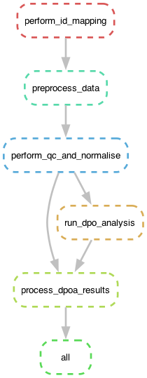

# MagPipe

MagPipe is a comprehensive analysis pipeline developed specifically for performing differential phosphosite occupancy analysis on phosphoproteomics data. It has been tailored to process the dataset published in the following paper, which explores phosphorylation patterns across various cell lines and kinase perturbations:

*Hijazi M, Smith R, Rajeeve V, Bessant C, Cutillas PR. Reconstructing kinase network topologies from phosphoproteomics data reveals cancer-associated rewiring. [Nat Biotechnol. 2020 Apr](https://www.nature.com/articles/s41587-019-0391-9)*

However, MagPipe can also be used to analyse other phosphoproteomics datasets, as it includes functionalities for harmonising protein IDs, quality control, quantile normalisation, batch correction, and differential phosphosite occupancy analysis. Unique features of the MagPipe package are its method for estimating missing fold changes and the calculation of signal-intensity dependent confidence scores.

MagPipe was created with [cookiecutter-bioinformatics-project](https://github.com/maxplanck-ie/cookiecutter-bioinformatics-project), a bioinformatics pipeline template provided by the Max Planck Institute of Immunobiology and Epigenetics, which builds on [cookiecutter-fair-data-science](https://github.com/FAIR4HEP/cookiecutter4fair) and [Snakemake](https://snakemake.readthedocs.io/en/stable/snakefiles/deployment.html#distribution-and-reproducibility). This ensures a streamlined, reproducible workflow for phosphoproteomics analysis.

## Getting Started

### Dependencies
- Python 3.8+
- R 4.0+
- Required Python packages: snakemake, uniprot-id-mapper (see `environment.yaml` for a complete list)
- Required R packages: limma, reshape2, plyr

### Cloning and Running the Snakemake Project

1. **Clone the MagPipe repository:**
```bash
git clone git@github.com:magdalenahuebner/magpipe.git
cd magpipe
```

2. **Activate the Conda environment:**
```bash
conda env create -f environment.yaml
conda activate magpipe
```

3. **Import your data:**
Add your phosphoproteomics data and corresponding metadata to `resources/raw_data`. Make sure the data is formatted correctly (see [Input File Formatting](#input-file-formatting)). Edit the Snakefile in `workflow/Snakefile` and replace `phosphodata_aup.tsv` and `metadata.tsv` with the names of your data and metadata files.

4. **Execute the pipeline:**
```bash
snakemake --cores 1
```

### Alternative: Using MagPipe as a Module
MagPipe can also be integrated into your Python projects as a module:

1. **Install MagPipe:**
```bash
python -m pip install git+https://github.com/magdalenahuebner/magpipe.git
```

2. **Import as library:**
```python
import magpipe
```
## Input File Formatting

Input files should be in TSV format. The phosphoproteomics dataset file should contain the quantified phosphosites (e.g. area under the peak values from MS1 spectra) formatted with phosphosite names as rows and samples as columns. The metadata file should contain a column named 'sampleID', with sample names/IDs corresponding to the column names of the phosphoproteomics data.

## Workflow Overview

The MagPipe workflow encompasses several critical steps: 



A more detailed explanation of the workflow is provided in a collection of Jupyter notebooks, which can be found in `notebooks/`.
